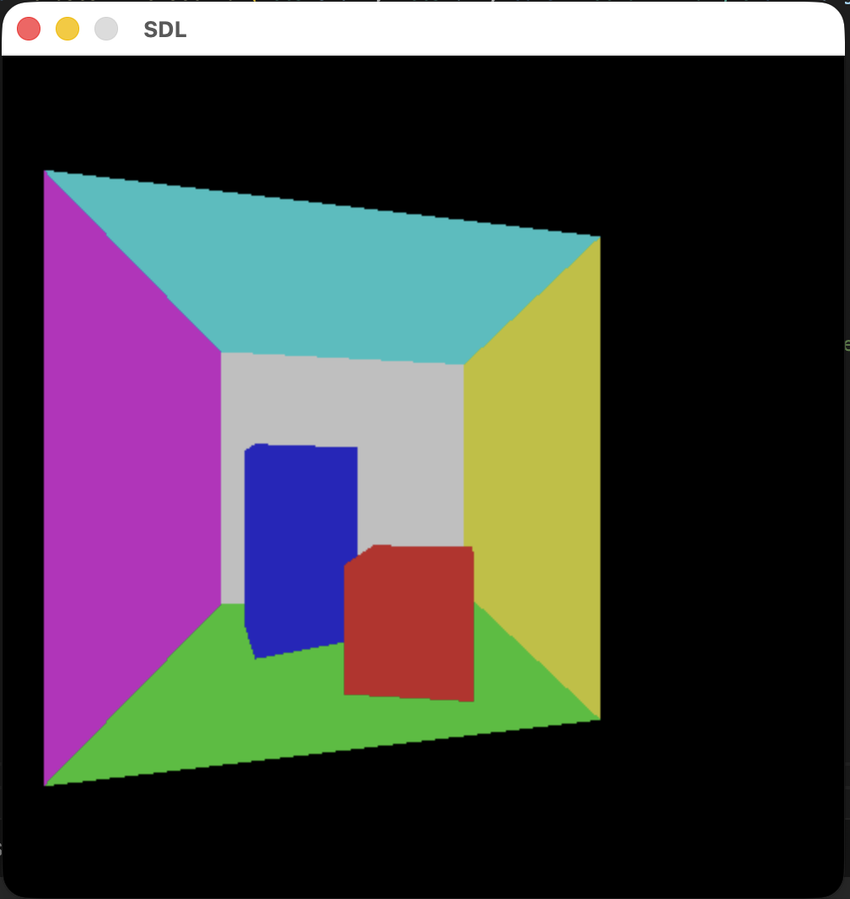
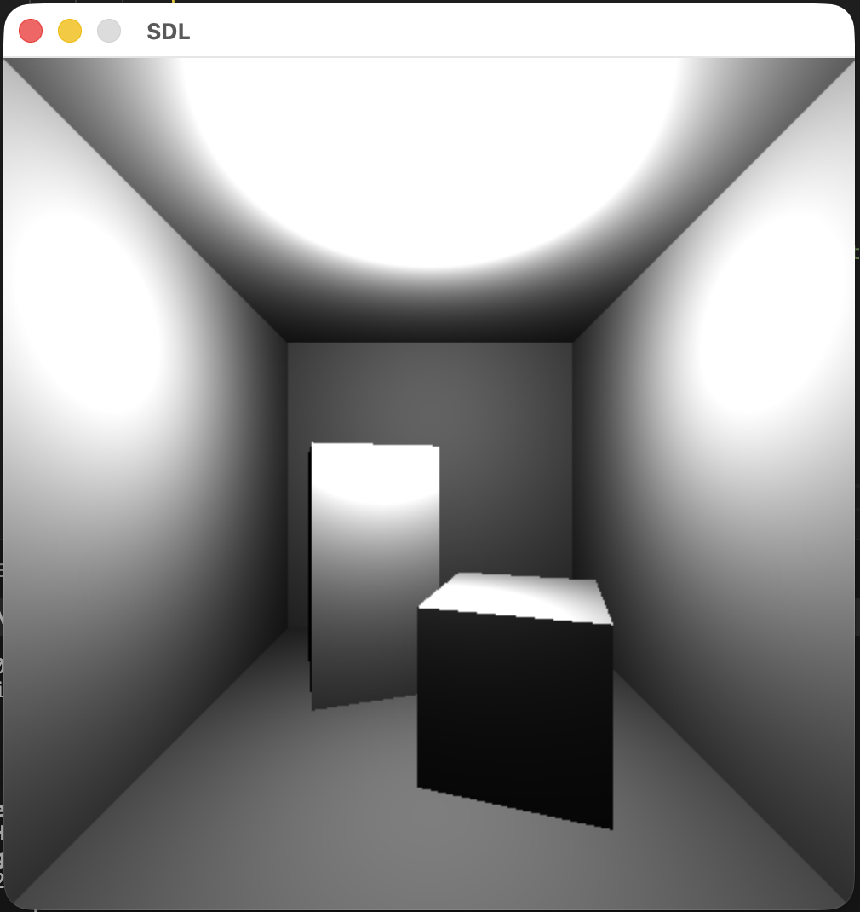
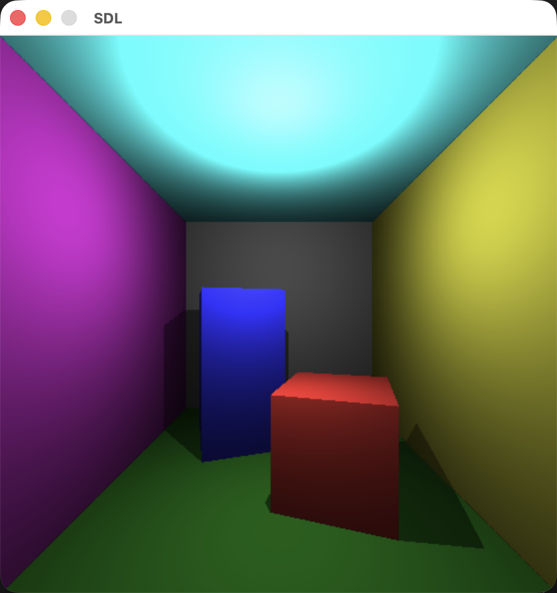

# DH2323 — Computer Graphics
> Laboratory work and projects for the **DH2323** course at **KTH Royal Institute of Technology**.  
> Covers the transition from 2D raster manipulation to 3D Raytracing and physical light simulation.

---

## 📁 Labs Overview

### Lab 1 — Projections & Interpolation
Focused on the transition from 2D pixel plotting to 3D coordinate systems.

- **Linear Interpolation** — Numerical and vector interpolation to generate smooth color gradients across the viewport.
- **Starfield Simulation** — Real-time animation of 3D points moving toward a pinhole camera.
- **Perspective Projection** — Mapping 3D coordinates `(x, y, z)` to 2D screen coordinates `(u, v)` using focal length and aspect ratio calculations.

  
  

---

### Lab 2 — Raytracing
A CPU-based raytracer designed to render 3D scenes by tracing light paths from the camera into the environment.

- **Geometry Engine** — Scenes modeled using triangular surfaces with pre-computed normals.
- **Ray-Triangle Intersection** — Solving the linear system `Ax = b` via matrix inversion to find the exact hit point `(t, u, v)`.
- **Camera System** — Interactive movement with `3×3` rotation matrices for Y-axis yaw.
- **Lighting Model:**
  - *Direct Illumination* — Lambertian reflectance based on the dot product between surface normals and light direction vectors.
  - *Shadow Rays* — Secondary rays cast from intersection points to the light source to detect occlusions.
  - *Indirect Illumination* — Constant ambient term approximation to simulate light bounces.

  
  
  

---
